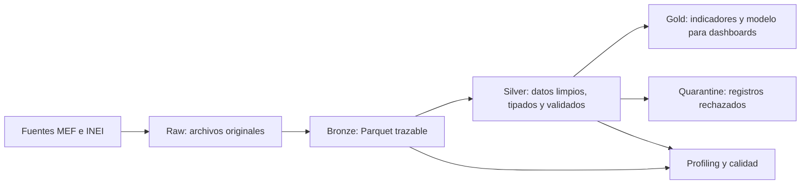

# Big Data Parcial: Presupuesto e Ingresos Municipales

Proyecto de arquitectura Medallion en PySpark para analizar presupuesto, ejecucion
de ingresos e indicadores prediales de municipalidades del Peru.

El proyecto integra tres fuentes:

- **SIAF Ingresos (MEF):** presupuesto y ejecucion de ingresos.
- **SISMEPRE (MEF):** seguimiento de metas e indicadores del impuesto predial.
- **RENAMU 2022 (INEI):** atributos complementarios de municipalidades.

## Arquitectura Medallion



## Que Hace Cada Capa

| Capa | Proposito | Que hace este proyecto | Estado |
|---|---|---|---|
| `raw` | Conservar la fuente original sin transformarla. | Descarga CSV, ZIP y PDF desde MEF e INEI y los guarda bajo `data/raw`. | Implementada |
| `bronze` | Estandarizar el almacenamiento sin alterar el significado del dato. | Lee Raw, genera Parquet Snappy, agrega trazabilidad y ejecuta profiling y calidad. | Implementada |
| `silver` | Limpiar, tipar, normalizar y validar datos listos para analisis. | Construye dimensiones y hechos municipales, separa rechazos en cuarentena y registra auditoria. | Implementada parcialmente por disponibilidad de la fuente |
| `gold` | Crear indicadores y modelos para consumo analitico. | Preparara KPIs y tablas para seis dashboards. | Pendiente |

## Capa Raw

Ubicacion: `data/raw`

Raw funciona como evidencia de origen. Aqui viven los archivos descargados tal como
llegan desde las fuentes. No se deben colocar CSV, ZIP o PDF dentro de Bronze.

Las fuentes y URLs se administran en [`config.yaml`](config.yaml).

## Capa Bronze

Ubicacion: `data/bronze`

Bronze transforma los archivos Raw a Parquet comprimido con Snappy. Conserva el
contenido fuente y agrega columnas tecnicas para poder rastrear cada registro:

- `_bronze_source_path`
- `_bronze_source_url`
- `_bronze_source_checksum`
- `_bronze_execution_id`
- `_bronze_ingestion_ts`
- `_bronze_ingestion_date`

Tambien se generan perfiles y controles de calidad documentados para las ocho
dimensiones:

1. Completitud.
2. Unicidad.
3. Validez.
4. Consistencia.
5. Integridad.
6. Actualidad.
7. Disponibilidad.
8. Exactitud.

Para ejecutar Bronze:

```powershell
docker compose run --rm --no-deps transformers-networks python main.py
```

Tambien se puede procesar una fuente especifica:

```powershell
docker compose run --rm --no-deps transformers-networks python main.py ingresos
docker compose run --rm --no-deps transformers-networks python main.py sismepre
docker compose run --rm --no-deps transformers-networks python main.py renamu
```

## Capa Silver

Ubicacion: `data/silver`

Silver se ejecuta con [`main_silver.py`](main_silver.py). Esta capa:

- Normaliza codigos como `SEC_EJEC` y `UBIGEO`.
- Limpia nombres geograficos.
- Convierte montos, cantidades y fechas a tipos correctos.
- Deduplica usando la granularidad de negocio.
- Conserva trazabilidad Bronze y agrega:
  - `_silver_execution_id`
  - `_silver_ingestion_ts`
- Publica rechazos bajo `data/silver/_quarantine`.
- Elimina cuarentenas obsoletas antes de una nueva publicacion.
- Registra auditoria y checks de calidad en `data/audit`.

Para ejecutar Silver:

```powershell
docker compose run --rm --no-deps transformers-networks python main_silver.py
```

### Tablas Silver Publicadas

| Tabla | Filas actuales | Uso |
|---|---:|---|
| `dim_municipalidad` | 1,111 | Catalogo municipal canonico para filtros y cruces geograficos. |
| `fact_predial_esat` | 133,172 | Indicadores prediales SISMEPRE tipados y deduplicados. |
| `fact_sismepre_respuestas` | 205,823 | Respuestas SISMEPRE normalizadas a formato largo. |
| `dim_sismepre_entidad_estado` | 19,037 | Estado y clasificacion por municipalidad y periodo. |
| `dim_sismepre_pregunta` | 696 | Catalogo de preguntas SISMEPRE. |
| `dim_sismepre_formulario` | 94 | Catalogo de formularios SISMEPRE. |

### Dimension Municipal

`dim_municipalidad` se construye desde la relacion estable SISMEPRE
`SEC_EJEC -> UBIGEO` y se enriquece mediante `left join` con RENAMU 2022.

- Se conservan las `1,111` municipalidades de SISMEPRE.
- `587` tienen coincidencia RENAMU.
- `524` se conservan con `renamu_match=false`.

RENAMU es un enriquecimiento parcial, no un filtro excluyente.

### Respuestas SISMEPRE

Las respuestas se transforman a formato largo. Una respuesta puede generar una
fila de tipo `texto`, `decimal`, `entero` o `fecha`.

- `31,615` respuestas fuente contienen dos valores activos.
- Silver genera dos filas para esos casos sin perder informacion.
- El valor textual `"0"` se conserva cuando es una respuesta valida.
- Los ceros usados como marcadores inactivos en campos numericos no se publican.
- Las fechas aceptan formato ISO y formato peruano `d/M/yyyy HH:mm:ss`.
- Actualmente existen `2` filas sin valor activo en cuarentena.

## Bloqueo Actual De Ingresos Municipales

`fact_ingresos_municipales` no se publica todavia. El Bronze actual contiene:

| Nivel de gobierno | Filas |
|---|---:|
| Regional (`R`) | 125,300 |
| Municipal (`M`) | 0 |
| Sin nivel informado | 3 |

El pipeline Silver termina con estado `partial` de forma intencional. No publica
datos regionales como si fueran municipales. Cuando la fuente Bronze incluya
filas `NIVEL_GOBIERNO = 'M'`, la misma transformacion publicara la tabla municipal
particionada por `year`.

## Auditoria Y Calidad

Ubicaciones principales:

| Ruta | Contenido |
|---|---|
| `data/audit/executions` | Resultado y estado de cada ejecucion. |
| `data/audit/quality_checks` | Checks de calidad Bronze y Silver. |
| `data/audit/metrics` | Snapshots de metricas e inventario de tablas. |
| `data/silver/_quarantine` | Registros rechazados con motivo y trazabilidad. |

Ultima ejecucion Silver validada: `20260531_062626`.

| Indicador | Resultado |
|---|---:|
| Tablas publicadas | 6 |
| Tablas bloqueadas | 1 |
| Registros publicados | 359,933 |
| Registros en cuarentena | 2 |
| Checks fallidos | 0 |
| Errores del pipeline | 0 |

## Notebooks

| Notebook | Proposito |
|---|---|
| [`01_Bronze_Pipeline_Parcial.ipynb`](notebooks/01_Bronze_Pipeline_Parcial.ipynb) | Evidencia del pipeline Bronze. |
| [`02_Profiling_Ingresos.ipynb`](notebooks/02_Profiling_Ingresos.ipynb) | Perfilado y calidad de Ingresos. |
| [`03_Profiling_SISMEPRE.ipynb`](notebooks/03_Profiling_SISMEPRE.ipynb) | Perfilado y calidad de SISMEPRE. |
| [`04_Profiling_RENAMU.ipynb`](notebooks/04_Profiling_RENAMU.ipynb) | Perfilado y calidad de RENAMU. |
| [`05_Silver_Pipeline_Parcial.ipynb`](notebooks/05_Silver_Pipeline_Parcial.ipynb) | Evidencia Silver: inventario, esquemas, calidad, cuarentena y bloqueo municipal. |

## Pruebas

La suite cubre contrato Bronze, bloqueo de ingresos regionales, match parcial
RENAMU, granularidad predial, respuestas multivalor, fechas invalidas y limpieza
idempotente de cuarentena.

```powershell
docker compose run --rm --no-deps transformers-networks python -m unittest discover -s tests -v
```

Resultado validado: `7/7` pruebas aprobadas.

## Preparacion Para Gold

Silver deja contratos listos para construir posteriormente:

1. Evolucion mensual del presupuesto y recaudacion municipal.
2. Avance de ejecucion por municipalidad.
3. Ranking territorial por recaudacion.
4. Indicadores de impuesto predial.
5. Cobertura y cumplimiento de metas SISMEPRE.
6. Calidad y cobertura de datos por fuente.

Los dashboards dependientes de ingresos municipales podran completarse cuando la
fuente Bronze incorpore registros de nivel `M`.
