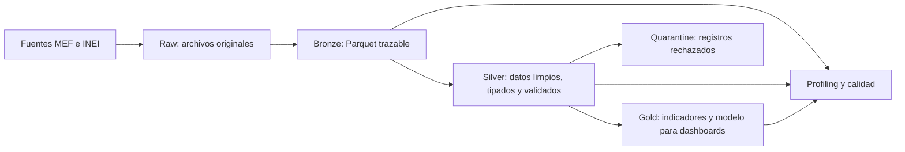
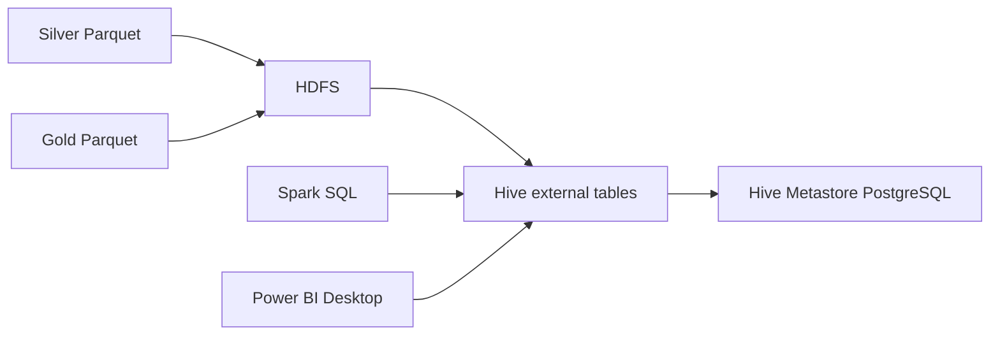

# Big Data Parcial: Presupuesto e Ingresos Municipales

Proyecto de arquitectura Medallion en PySpark para analizar presupuesto, ejecucion
de ingresos e indicadores prediales de municipalidades del Peru.

El proyecto integra tres fuentes:

- **SIAF Ingresos (MEF):** presupuesto y ejecucion de ingresos.
- **SISMEPRE (MEF):** seguimiento de metas e indicadores del impuesto predial.
- **RENAMU 2022 (INEI):** atributos complementarios de municipalidades.

Ademas usa el archivo de referencia entregado por el profesor
`data/raw/CategoriasMunicipalidades.csv` para enriquecer la categoria municipal
`A-G`. Este archivo no reemplaza las tres fuentes oficiales.

## Arquitectura Medallion



## Que Hace Cada Capa

| Capa | Proposito | Que hace este proyecto | Estado |
|---|---|---|---|
| `raw` | Conservar la fuente original sin transformarla. | Descarga CSV, ZIP y PDF desde MEF e INEI y los guarda bajo `data/raw`. | Implementada |
| `bronze` | Estandarizar el almacenamiento sin alterar el significado del dato. | Lee Raw, genera Parquet Snappy, agrega trazabilidad y ejecuta profiling y calidad. | Implementada |
| `silver` | Limpiar, tipar, normalizar y validar datos listos para analisis. | Publica datasets curados en Parquet, separa rechazos en cuarentena y registra auditoria. No crea facts ni dimensiones. | Implementada |
| `gold` | Crear indicadores y modelos para consumo analitico. | Publica dimensiones, facts, marts y KPIs optimizados para los seis dashboards. | Implementada |

## Capa Raw

Ubicacion: `data/raw`

Raw funciona como evidencia de origen. Aqui viven los archivos descargados tal como
llegan desde las fuentes. No se deben colocar CSV, ZIP o PDF dentro de Bronze.

Las fuentes y URLs se administran en [`config.yaml`](config.yaml).

## Capa Bronze

Ubicacion: `data/bronze`

Bronze transforma los archivos Raw a Parquet comprimido con Snappy. Conserva el
contenido fuente y agrega columnas tecnicas para poder rastrear cada registro:

- `_bronze_source_path`
- `_bronze_source_url`
- `_bronze_source_checksum`
- `_bronze_execution_id`
- `_bronze_ingestion_ts`
- `_bronze_ingestion_date`

Tambien se generan perfiles y controles de calidad documentados para las ocho
dimensiones:

1. Completitud.
2. Unicidad.
3. Validez.
4. Consistencia.
5. Integridad.
6. Actualidad.
7. Disponibilidad.
8. Exactitud.

Para ejecutar Bronze:

```powershell
docker compose run --rm --no-deps transformers-networks python main.py
```

Tambien se puede procesar una fuente especifica:

```powershell
docker compose run --rm --no-deps transformers-networks python main.py ingresos
docker compose run --rm --no-deps transformers-networks python main.py sismepre
docker compose run --rm --no-deps transformers-networks python main.py renamu
docker compose run --rm --no-deps transformers-networks python main.py categorias_municipalidades
```

## Capa Silver

Ubicacion: `data/silver`

Silver se ejecuta con [`main_silver.py`](main_silver.py). Esta capa:

- Normaliza codigos como `SEC_EJEC` y `UBIGEO`.
- Limpia nombres geograficos.
- Convierte montos, cantidades y fechas a tipos correctos.
- Deduplica usando la granularidad de negocio.
- Conserva trazabilidad Bronze y agrega:
  - `_silver_execution_id`
  - `_silver_ingestion_ts`
- Publica rechazos bajo `data/silver/_quarantine`.
- Elimina cuarentenas obsoletas antes de una nueva publicacion.
- Registra auditoria y checks de calidad en `data/audit`.

Para ejecutar Silver:

```powershell
docker compose run --rm --no-deps transformers-networks python main_silver.py
```

### Datasets Silver Publicados

Silver no aplica modelado dimensional. Por eso no publica tablas `fact_*` ni
`dim_*`: solo deja datasets limpios, tipados, deduplicados y trazables para que
Gold construya el modelo analitico.

| Dataset | Filas actuales | Uso |
|---|---:|---|
| `municipalidades_curated` | 1,113 | Relacion municipal limpia `SEC_EJEC -> UBIGEO`, nombres geograficos normalizados y enriquecimiento basico RENAMU. |
| `ingresos_municipales_curated` | 8,950,779 | Movimientos SIAF municipales tipados, filtrados por `NIVEL_GOBIERNO = M` y consolidados por clave presupuestaria. |
| `predial_esat_curated` | 133,938 | Indicadores prediales SISMEPRE tipados, deduplicados y con granularidad corregida. |
| `sismepre_respuestas_curated` | 205,823 | Respuestas SISMEPRE normalizadas a formato largo, con tipos `texto`, `decimal`, `entero` y `fecha`. |
| `sismepre_entidad_estado_curated` | 19,037 | Estado, clasificacion y tipo de meta SISMEPRE limpios por municipalidad y periodo. |
| `sismepre_preguntas_curated` | 836 | Preguntas SISMEPRE limpias para posterior dimensionamiento en Gold. |
| `sismepre_formularios_curated` | 98 | Formularios SISMEPRE limpios para posterior dimensionamiento en Gold. |
| `categorias_municipalidades_curated` | 1,707 | Categoria municipal `A-G` normalizada desde el archivo del profesor. |

La logica que antes estaba mal ubicada en Silver fue movida a Gold:
`dim_municipalidad_gold`, `dim_tiempo`, `dim_clasificador_ingreso`,
`dim_formulario_sismepre`, `dim_pregunta_sismepre`,
`fact_ingresos_mensuales`, `fact_ingresos_clasificador`,
`fact_predial_mensual`, `fact_sismepre_cumplimiento` y los facts RENAMU.

### Municipalidades Curadas

`municipalidades_curated` se construye desde la relacion estable SISMEPRE
`SEC_EJEC -> UBIGEO` y se enriquece mediante `left join` con RENAMU 2022.

- Se conservan las `1,113` municipalidades de SISMEPRE.
- `1,110` tienen coincidencia RENAMU.
- `3` se conservan con `renamu_match=false`.

RENAMU es un enriquecimiento parcial, no un filtro excluyente.

## Alcance De Municipalidades Presentadas

El contrato para el archivo que comparta el profesor esta en:

```text
data/reference/municipalidades_presentadas.csv
```

Columnas aceptadas:

- `SEC_EJEC`
- `UBIGEO`
- `MUNICIPALIDAD_NOMBRE`

La clave prioritaria es `SEC_EJEC`; si no esta disponible, se usa `UBIGEO`.
Bronze y Silver conservan todas las municipalidades. Gold agrega
`in_scope_presentacion` en `dim_municipalidad_gold` y filtra los facts de
dashboards solo cuando el archivo contiene filas. Si la plantilla esta vacia,
Gold registra `pendiente_archivo_profesor` y conserva todo el universo municipal.

Los snapshots del alcance se guardan en `data/audit/metrics` con nombre
`scope_municipalidades_<execution_id>.json`.

## Categorias Municipales

El archivo `data/raw/CategoriasMunicipalidades.csv` tiene las columnas
`Municipalidad` y `Categoria`. Como no trae `SEC_EJEC` ni `UBIGEO`, el cruce se
hace por nombre normalizado y de forma conservadora:

- `matched`: categoria asignada por nombre normalizado unico.
- `ambiguous`: el nombre normalizado corresponde a mas de una municipalidad; no
  se asigna categoria silenciosamente.
- `unmatched`: no hay categoria para la municipalidad.
- `missing_category_source`: la tabla Silver de categorias no existe.

Gold agrega `categoria_municipalidad` y `categoria_match_status` en
`dim_municipalidad_gold`. La evidencia queda en
`data/audit/metrics/category_match_<execution_id>.json`.

## Tratamiento Temporal

- SIAF Ingresos se analiza como serie mensual 2012-2026.
- SISMEPRE se analiza por los anios y periodos disponibles en sus tablas.
- RENAMU 2022 se usa como fuente estatica de enriquecimiento municipal; no se
  generaliza como serie temporal.

### Respuestas SISMEPRE

Las respuestas se transforman a formato largo. Una respuesta puede generar una
fila de tipo `texto`, `decimal`, `entero` o `fecha`.

- `31,615` respuestas fuente contienen dos valores activos.
- Silver genera dos filas para esos casos sin perder informacion.
- El valor textual `"0"` se conserva cuando es una respuesta valida.
- Los ceros usados como marcadores inactivos en campos numericos no se publican.
- Las fechas aceptan formato ISO y formato peruano `d/M/yyyy HH:mm:ss`.
- Actualmente existen `2` filas sin valor activo en cuarentena.

## Ingresos Municipales SIAF

Los CSV historicos oficiales se descargan completos desde el portal MEF. Bronze
contiene:

| Nivel de gobierno | Filas |
|---|---:|
| Nacional (`E`) | 710,380 |
| Regional (`R`) | 1,197,863 |
| Municipal (`M`) | 8,950,816 |

La descarga valida el tamano remoto antes de reutilizar un archivo Raw. Si un
CSV quedo incompleto, se reemplaza automaticamente en la siguiente ingesta.
Para las fuentes vivas 2025-2026 tambien se conserva metadata remota
`Content-Length` y `Last-Modified` en archivos `.metadata.json`.

`ingresos_municipales_curated` se publica con las filas
`NIVEL_GOBIERNO = 'M'`, consolidadas por clave presupuestaria y particionadas
por `year`. El pipeline conserva `_silver_source_row_count` para rastrear
movimientos agrupados y una proteccion: si una futura descarga no contiene filas
municipales, bloquea solo este dataset y nunca publica datos regionales como
sustituto.

## Auditoria Y Calidad

Ubicaciones principales:

| Ruta | Contenido |
|---|---|
| `data/audit/executions` | Resultado y estado de cada ejecucion. |
| `data/audit/quality_checks` | Checks de calidad Bronze, Silver y Gold. |
| `data/audit/metrics` | Snapshots de metricas e inventario de tablas. |
| `data/silver/_quarantine` | Registros rechazados con motivo y trazabilidad. |
| `data/gold` | Modelo analitico Gold en Parquet Snappy para Power BI. |

Para regenerar perfiles HTML de Silver y Gold:

```powershell
docker compose run --rm --no-deps transformers-networks python scripts/profile_medallion_layers.py
```

Los indices generados quedan en:

- `reports/silver/index.html`
- `reports/gold/index.html`

Ultima reconstruccion Bronze validada: `2026-06-12`, documentada en
[`reports/rebuild_bronze_silver_gold_20260607.md`](reports/rebuild_bronze_silver_gold_20260607.md).

Bronze finaliza con estado `partial` porque conserva `10` alertas de calidad de
origen SISMEPRE: seis checks de unicidad predial con granularidad cruda y cuatro
checks de consistencia por respuestas multivalor. Silver corrige ambos casos al
usar la clave predial completa y normalizar respuestas a formato largo.

Ultima ejecucion Silver validada: `20260612_060020`.

| Indicador | Resultado |
|---|---:|
| Datasets publicados | 8 |
| Tablas bloqueadas | 0 |
| Registros publicados | 9,313,331 |
| Registros en cuarentena | 162 |
| Checks fallidos | 0 |
| Errores del pipeline | 0 |

## Notebooks

| Notebook | Proposito |
|---|---|
| [`01_Bronze_Pipeline_Parcial.ipynb`](notebooks/01_Bronze_Pipeline_Parcial.ipynb) | Evidencia del pipeline Bronze. |
| [`02_Profiling_Ingresos.ipynb`](notebooks/02_Profiling_Ingresos.ipynb) | Perfilado y calidad de Ingresos. |
| [`03_Profiling_SISMEPRE.ipynb`](notebooks/03_Profiling_SISMEPRE.ipynb) | Perfilado y calidad de SISMEPRE. |
| [`04_Profiling_RENAMU.ipynb`](notebooks/04_Profiling_RENAMU.ipynb) | Perfilado y calidad de RENAMU. |
| [`05_Silver_Pipeline_Parcial.ipynb`](notebooks/05_Silver_Pipeline_Parcial.ipynb) | Evidencia Silver: inventario, esquemas, calidad, cuarentena y proteccion ante ausencia de datos municipales. |
| [`06_Gold_Pipeline_Parcial.ipynb`](notebooks/06_Gold_Pipeline_Parcial.ipynb) | Evidencia Gold: constelacion de hechos, dimensiones normalizadas, cobertura municipal, KPIs y mapeo de dashboards. |

## Pruebas

La suite cubre contrato Bronze, descargas incompletas, bloqueo de ingresos
regionales, consolidacion presupuestaria municipal, match parcial RENAMU,
granularidad predial, respuestas multivalor, fechas invalidas y limpieza
idempotente de cuarentena.

```powershell
docker compose run --rm --no-deps transformers-networks python -m unittest discover -s tests -v
```

Resultado validado: `15/15` pruebas aprobadas.

## Capa Gold

Ubicacion: `data/gold`

Gold se ejecuta con [`main_gold.py`](main_gold.py). Lee exclusivamente Silver,
publica Parquet Snappy y conserva trazabilidad Silver junto con:

- `_gold_execution_id`
- `_gold_ingestion_ts`

Para ejecutar Gold:

```powershell
docker compose run --rm --no-deps transformers-networks python main_gold.py
```

Ultima actualizacion Gold para dashboards: `2026-06-12`.

El modelo Gold queda como una **constelacion de hechos con copo de nieve
parcial**. Es decir: hay varias tablas `fact_*` para distintos procesos de
negocio, comparten dimensiones conformadas como municipalidad, tiempo, UBIGEO y
categoria, y algunas dimensiones se normalizan en tablas propias para evitar
duplicacion innecesaria. Este enfoque es equivalente al criterio del caso MEF:
las tablas analiticas finales recien aparecen en Gold.

| Tabla | Filas actuales | Uso |
|---|---:|---|
| `dim_municipalidad_gold` | 1,964 | Maestro municipal SIAF enriquecido con SISMEPRE y RENAMU. |
| `dim_ubigeo` | 1,964 | Dimension geografica normalizada: UBIGEO, departamento, provincia y distrito. |
| `dim_tiempo` | 173 | Calendario mensual continuo. |
| `dim_clasificador_ingreso` | 2,791 | Jerarquia presupuestaria SIAF. |
| `dim_estado_sismepre` | 15 | Estados, clasificaciones y tipos de meta SISMEPRE normalizados. |
| `dim_formulario_sismepre` | 98 | Catalogo analitico de formularios. |
| `dim_pregunta_sismepre` | 836 | Catalogo analitico de preguntas. |
| `fact_ingresos_mensuales` | 325,090 | PIA, PIM, recaudado, ejecucion y variacion por municipalidad y mes. |
| `fact_ingresos_clasificador` | 8,950,758 | Drill-down mensual por clasificador de ingreso. |
| `fact_predial_mensual` | 49,602 | Indicadores prediales ordinarios, coactivos y totales. |
| `fact_sismepre_cumplimiento` | 19,037 | Estado, clasificacion y meta SISMEPRE. |
| `fact_sismepre_respuestas_resumen` | 205,533 | Resumen analitico de respuestas SISMEPRE. |
| `fact_renamu_gestion_tributaria` | 1,874 | Capacidad municipal RENAMU: personal municipal total y necesidades AT/catastro. |
| `fact_renamu_software_at` | 1,874 | Software tributario RENAMU: SRTM, rentas, catastro y flag de al menos un software. |
| `mart_dashboard_municipal` | 28,628 | Vista integrada SIAF, SISMEPRE, RENAMU y categorias para los seis dashboards. |
| `fact_calidad_datos` | 5,583 | Historial auditable de calidad Bronze, Silver y Gold. |

El maestro conserva las `1,964` entidades municipales SIAF: `1,113` tienen
cobertura SISMEPRE y `851` siguen disponibles con geografia SIAF. RENAMU
enriquece `1,110` coincidencias sin excluir ninguna municipalidad.
La dimension tambien expone `categoria_municipalidad` y
`categoria_match_status` cuando existe el archivo de categorias.

### Relaciones Principales

| Desde | Hacia | Tipo |
|---|---|---|
| `dim_municipalidad_gold.SEC_EJEC` | `fact_ingresos_mensuales.SEC_EJEC` | 1 a muchos |
| `dim_municipalidad_gold.SEC_EJEC` | `fact_ingresos_clasificador.SEC_EJEC` | 1 a muchos |
| `dim_municipalidad_gold.SEC_EJEC` | `fact_predial_mensual.SEC_EJEC` | 1 a muchos |
| `dim_municipalidad_gold.SEC_EJEC` | `fact_sismepre_cumplimiento.SEC_EJEC` | 1 a muchos |
| `dim_municipalidad_gold.SEC_EJEC` | `fact_renamu_gestion_tributaria.SEC_EJEC` | 1 a muchos |
| `dim_ubigeo.ubigeo_id` | `dim_municipalidad_gold.UBIGEO` | 1 a muchos |
| `dim_tiempo.periodo_id` | facts mensuales `periodo_id` | 1 a muchos |
| `dim_clasificador_ingreso.clasificador_id` | `fact_ingresos_clasificador.clasificador_id` | 1 a muchos |
| `dim_estado_sismepre.estado_sismepre_id` | `fact_sismepre_cumplimiento.estado_sismepre_id` | 1 a muchos |

### Dashboards Habilitados

Gold deja contratos listos para seis paginas de toma de decision:

1. Recaudacion Municipal vs Capacidad Tributaria.
2. Recaudacion por Clasificador de Ingreso.
3. Predial vs Efectividad.
4. Distribucion de Efectividad Predial.
5. Software Tributario Municipal.
6. Priorizacion de Municipalidades.

Todas usan `categoria_municipalidad` como filtro/segmentador A-G cuando el
archivo `CategoriasMunicipalidades.csv` tiene match confiable. RENAMU se usa
como fuente estatica 2022: el archivo local no trae literalmente "personal
exclusivo AT", por eso el dashboard de capacidad tributaria usa
`personal_municipal_total` y los indicadores de asistencia/capacitacion en
administracion tributaria y catastro como aproximaciones documentadas.

Los controles de calidad permanecen disponibles en `fact_calidad_datos` como
evidencia tecnica auditable, pero no ocupan una pagina de toma de decisiones.

La capa visual de Power BI queda separada del procesamiento: puede conectarse
directamente a estos Parquet o a una exportacion posterior sin reprocesar Bronze.

## Hive, HDFS Y Spark SQL

El proyecto ahora incluye una capa de consulta analitica con HDFS, Hive,
Metastore y Spark. Esta capa no crea una cuarta medalla; registra los Parquet
Silver y Gold como tablas externas para demostrar SQL analitico y conectar
Power BI por HiveServer2.



Servicios principales en Docker:

| Servicio | Rol | Puerto |
|---|---|---:|
| `namenode` | HDFS NameNode | `9870`, `8020` |
| `datanode` | HDFS DataNode | `9864` |
| `hive-metastore-db` | PostgreSQL del metastore | interno |
| `hive-metastore` | Catalogo Hive | `9083` |
| `hive-server` | HiveServer2 para Power BI | `10000` |

Para levantar el cluster:

```powershell
docker compose up -d namenode datanode hive-metastore-db hive-metastore hive-server transformers-networks
```

Para publicar las tablas externas desde Parquet:

```powershell
docker compose exec transformers-networks python scripts/hive_bootstrap.py --layer all
```

Para ejecutar el laboratorio Hive:

```powershell
docker compose exec transformers-networks python scripts/hive_lab_queries.py --create-views
```

El laboratorio cubre lectura de Parquet, agregaciones, filtros, ordenamiento,
tratamiento de nulos, window functions, CTEs y joins complejos. La explicacion
esta en:

```text
reports/hive_lab_municipal.md
```

Las vistas Hive para los seis dashboards estan en:

```text
sql/hive/03_dashboard_views.sql
reports/dashboard_spec_hive_municipal.md
```

Para generar un workbook desde Hive e importarlo en Power BI:

```powershell
docker compose exec transformers-networks python scripts/export_powerbi_from_hive.py
```

Salida:

```text
data/powerbi/powerbi_municipal_hive.xlsx
```

## Power BI Desktop

El reporte Power BI implementado se encuentra en:

```text
data/powerbi/Dashboard_Municipal_Gold.pbix
```

El archivo importa un workbook de presentacion generado desde Gold:

```text
data/powerbi/powerbi_municipal_gold.xlsx
```

Tambien existe un HTML interactivo con el mismo estilo visual verde y blanco del
ejemplo, pero debe tratarse como vista previa tecnica, no como sustituto del
Power BI nativo:

```text
data/powerbi/dashboard_municipal_gold.html
```

Para el entregable principal, Power BI debe consumir:

- Directo desde HiveServer2: `localhost:10000`, base `municipal_gold`, vistas
  `vw_dashboard_01_*` a `vw_dashboard_06_*`.
- O desde el workbook exportado por Hive:
  `data/powerbi/powerbi_municipal_hive.xlsx`.

Para regenerar las vistas de consumo despues de una nueva ejecucion Gold:

```powershell
docker compose run --rm --no-deps transformers-networks python scripts/export_powerbi_workbook.py
```

Para la exposicion, el comando de carga viva 2025-2026 es:

```powershell
docker compose run --rm --no-deps transformers-networks python scripts/live_siaf_2025_2026_demo.py
```

Ese comando muestra metadata remota/local de SIAF 2025-2026, actualiza solo esas
particiones Bronze de ingresos, reconstruye Silver y Gold, y regenera el workbook
Power BI.

El reporte contiene seis paginas:

1. `01 Recaudacion vs Capacidad`.
2. `02 Clasificador de ingreso`.
3. `03 Predial vs Efectividad`.
4. `04 Distribucion efectividad`.
5. `05 Software tributario`.
6. `06 Priorizacion municipal`.

El workbook tambien incluye `dashboard_diseno`, `medidas_dax` y
`evidencia_calidad`. Estas hojas ayudan a documentar la entrega, pero no son
paginas de toma de decision.

No se usan mapas externos. Las tres fuentes traen ubicacion administrativa
(`UBIGEO`, departamento, provincia y distrito), pero no traen latitud, longitud
ni geometria. Por rigor, el analisis territorial se entrega con rankings,
tablas y segmentadores geograficos.
