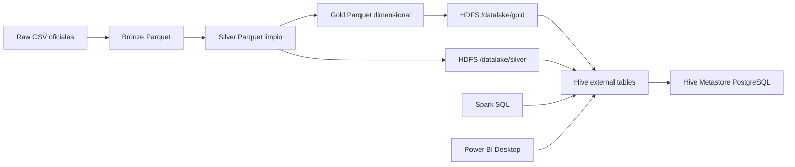

# Laboratorio Hive Municipal

## Objetivo

Agregar una capa de consulta analitica con HDFS, Hive, Metastore y Spark sobre
los Parquet Medallion del proyecto municipal. Hive no reemplaza Bronze, Silver
ni Gold: registra sus Parquet como tablas externas y permite demostrar SQL
analitico para Power BI.

## Arquitectura



## Componentes Docker

| Servicio | Rol | Puerto |
|---|---|---:|
| `namenode` | Metadata HDFS | `9870`, `8020` |
| `datanode` | Bloques HDFS | `9864` |
| `hive-metastore-db` | PostgreSQL del metastore | interno |
| `hive-metastore` | Catalogo Hive | `9083` |
| `hive-server` | HiveServer2 para Power BI/JDBC/ODBC | `10000` |
| `transformers-networks` | Jupyter + PySpark | `8000`, `4040` |

## Storage

- Formato: Parquet Snappy.
- Particiones: las tablas Gold conservan particiones por `year` cuando aplica.
- Tablas: externas, porque Hive solo registra metadata; los datos siguen en
  HDFS como Parquet.
- Metadata: Hive Metastore mantiene base, tabla, esquema y ubicacion.

## Comandos

Levantar el cluster:

```powershell
docker compose up -d namenode datanode hive-metastore-db hive-metastore hive-server transformers-networks
```

Publicar Gold y Silver en Hive:

```powershell
docker compose exec transformers-networks python scripts/hive_bootstrap.py --layer all
```

Ejecutar laboratorio:

```powershell
docker compose exec transformers-networks python scripts/hive_lab_queries.py --create-views
```

Exportar vistas Hive para Power BI:

```powershell
docker compose exec transformers-networks python scripts/export_powerbi_from_hive.py
```

## Consultas Cubiertas

| Tema pedido | Archivo |
|---|---|
| Lectura de Parquet | `sql/hive/04_lab_queries.sql` consulta 01 |
| Transformaciones y agregaciones | consulta 02 |
| Filtrado y ordenamiento | consulta 03 |
| Manejo de datos faltantes | consulta 04 |
| Window functions | consulta 05 |
| Consultas complejas con CTEs y joins | consulta 06 |

## Uso En Power BI

Opcion directa:

- Conector: Hive LLAP o Hive ODBC/JDBC, segun disponibilidad local.
- Servidor: `localhost`.
- Puerto: `10000`.
- Base: `municipal_gold`.
- Tablas/vistas: `vw_dashboard_01_*` a `vw_dashboard_06_*`.

Opcion fallback:

- Archivo: `data/powerbi/powerbi_municipal_hive.xlsx`.
- Uso: importar hojas a Power BI Desktop y crear las seis paginas nativas.

## Nota Sobre HTML

El HTML existente sirve como vista previa rapida, pero no es el entregable
principal si el profesor pide Power BI. La entrega defendible es Power BI nativo
conectado a Hive o al workbook exportado desde Hive.
